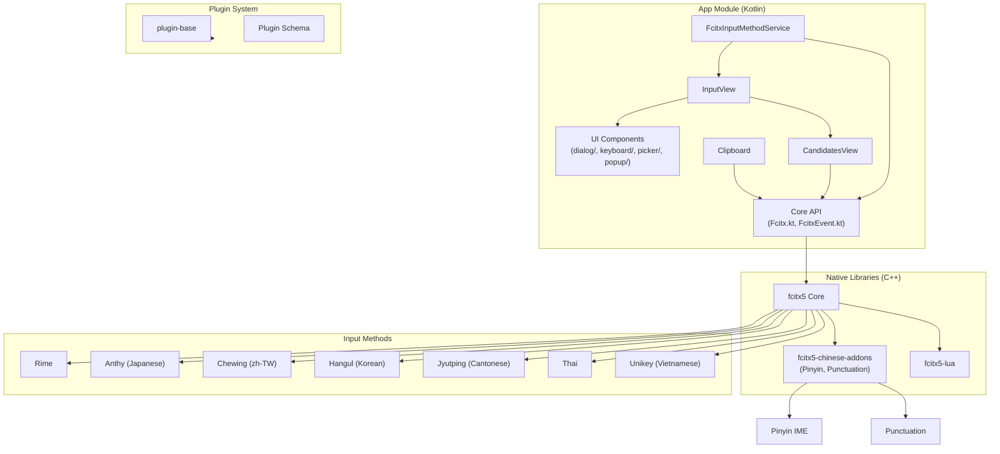
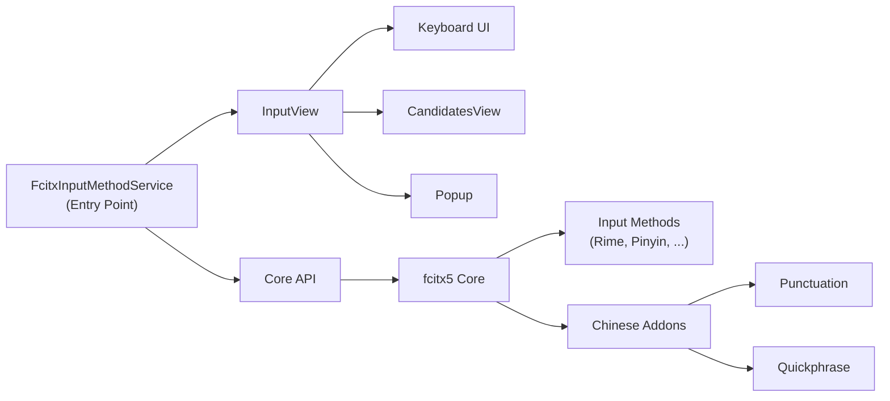

# fcitx5-android Architecture

## Overview

fcitx5-android is an Android Input Method Editor (IME) that brings the fcitx5 input method framework to the Android platform. It supports multiple input methods (Pinyin, Rime, Anthy for Japanese, Chewing for Traditional Chinese, etc.) and provides a customizable keyboard experience.

## Project Structure

```
fcitx5-android/
├── app/                    # Main Android application
├── lib/                    # Native libraries and input method engines
├── plugin/                 # Plugin system
├── build-logic/           # Gradle build conventions
└── codegen/               # Code generation
```

## Functional Areas

### 1. App Module (`app/src/main/java/org/fxboomk/fcitx5/android/`)

#### Core (`core/`)
- **Fcitx.kt** - Core Fcitx API wrapper
- **FcitxAPI.kt** - Fcitx interface definitions
- **FcitxEvent.kt** - Event system for input events
- **FcitxDispatcher.kt** - Event dispatching
- **FcitxLifecycle.kt** - Lifecycle management
- **SubtypeManager.kt** - Input method subtype management

#### Input (`input/`)
- **FcitxInputMethodService.kt** - Main IME service (66KB)
- **InputView.kt** - Input view handling (98KB)
- **CandidatesView.kt** - Candidate word display

##### Input Subdirectories:
| Directory | Purpose |
|-----------|---------|
| `action/` | Input actions |
| `bar/` | Status bar |
| `candidates/` | Candidate list handling |
| `clipboard/` | Clipboard integration |
| `config/` | Input configuration |
| `cursor/` | Cursor management |
| `dependency/` | Dependency injection |
| `keyboard/` | Keyboard rendering |
| `picker/` | Input method picker |
| `popup/` | Popup windows |
| `preedit/` | Preedit text handling |
| `status/` | Status indicators |

#### UI (`ui/`)
- Dialog, keyboard, picker, popup, and window management components
- Touch event handling

#### Daemon (`daemon/`)
- Background service components

#### Data (`data/`)
- Data models and repositories

#### Utils (`utils/`)
- Utility functions

#### Provider (`provider/`)
- Content providers

### 2. Library Modules (`lib/`)

| Module | Purpose |
|--------|---------|
| `fcitx5/` | Core fcitx5 C++ library |
| `fcitx5-chinese-addons/` | Chinese-specific addons (Pinyin, punctuation) |
| `fcitx5-lua/` | Lua scripting support |
| `libime/` | IME core library |
| `plugin-base/` | Plugin base classes |
| `anthy/` | Japanese Anthy engine |
| `chewing/` | Traditional Chinese Chewing engine |
| `hangul/` | Korean Hangul engine |
| `jyutping/` | Cantonese Jyutping engine |
| `rime/` | Rime input engine |
| `sayura/` | Sinhala Sayura engine |
| `thai/` | Thai engine |
| `unikey/` | Vietnamese Unikey engine |

### 3. Plugin Module (`plugin/`)

- Plugin schema and services
- Plugin-based extensibility

## Key Execution Flows

### Input Flow
```
User Input → FcitxInputMethodService → FcitxEvent → InputView → Keyboard/Candidates
```

### Candidate Selection Flow
```
Select Candidate → Fcitx API → Commit Text → Display
```

### Clipboard Flow
```
Clipboard Access → ClipboardAdapter → InputView → Integration
```

## Architecture Diagram



## Component Relationships



## Key Interfaces

- **FcitxAPI** - Main interface to fcitx5 core
- **FcitxInputMethodService** - Android IME service implementation
- **InputView** - Keyboard and input surface
- **CandidatesView** - Word candidate display

## Build System

- **Gradle** with Kotlin DSL
- **build-logic/** - Shared build conventions
- **codegen/** - Annotation processing and code generation

## Further Reading

- [README.md](./README.md) - Project overview
- [CLAUDE.md](./CLAUDE.md) - Development guidance
